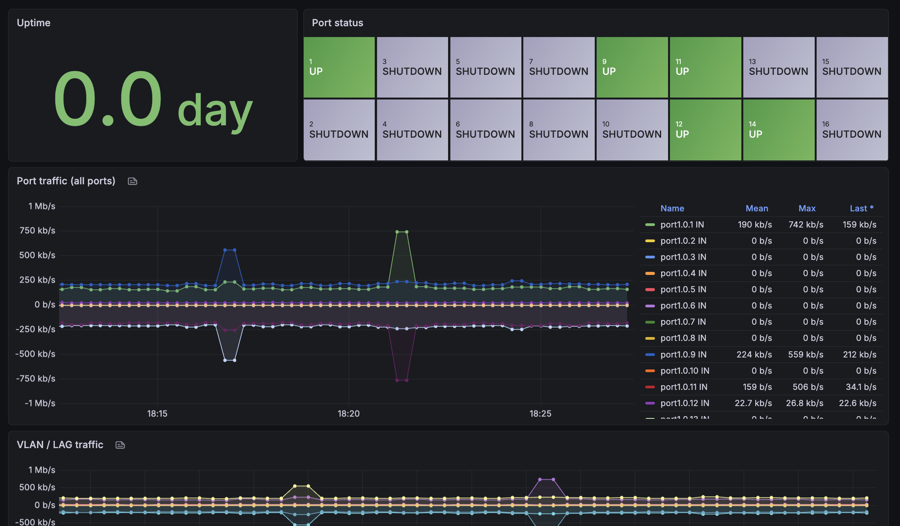

# Allied Telesis AT-XS916MXT Grafana Dashboard



## Overview

A Grafana dashboard for monitoring Allied Telesis AT-XS916MXT (10G L3 switch, AlliedWare Plus) via SNMP. It assumes you are using Prometheus and the SNMP Exporter as your data sources.

## Requirements

- SNMP must be enabled on the AT-XS916MXT:
  ```
  configure terminal
  snmp-server
  snmp-server community public ro
  end
  write
  ```
- A working Prometheus + SNMP Exporter setup.
- Grafana 11.0+ (with a "Prometheus" data source configured).

## Usage

1. **Prepare SNMP Exporter config**  
   Create a custom `snmp.yml` with an `allied_telesis` module. The module should walk the following OIDs:

   | OID                       | Metric        |
   | ------------------------- | ------------- |
   | `1.3.6.1.2.1.1.3`         | sysUpTime     |
   | `1.3.6.1.2.1.2.2.1.2`     | ifDescr       |
   | `1.3.6.1.2.1.2.2.1.5`     | ifSpeed       |
   | `1.3.6.1.2.1.2.2.1.7`     | ifAdminStatus |
   | `1.3.6.1.2.1.2.2.1.8`     | ifOperStatus  |
   | `1.3.6.1.2.1.31.1.1.1.1`  | ifName        |
   | `1.3.6.1.2.1.31.1.1.1.6`  | ifHCInOctets  |
   | `1.3.6.1.2.1.31.1.1.1.10` | ifHCOutOctets |
   | `1.3.6.1.2.1.31.1.1.1.15` | ifHighSpeed   |
   | `1.3.6.1.2.1.2.2.1.13`    | ifInDiscards  |
   | `1.3.6.1.2.1.2.2.1.14`    | ifInErrors    |
   | `1.3.6.1.2.1.2.2.1.19`    | ifOutDiscards |
   | `1.3.6.1.2.1.2.2.1.20`    | ifOutErrors   |

   The module should use both `ifDescr` and `ifName` as lookups. `ifDescr` reflects the port `description` command (if set), while `ifName` always returns the `port1.0.x` format.

2. **Update Prometheus config**  
   In your `prometheus.yml`, add:

   ```yaml
   - job_name: "snmp_xs916mxt"
     scrape_interval: 30s
     metrics_path: /snmp
     params:
       auth: [public_v2]
       module: [allied_telesis]
     static_configs:
       - targets:
           - 192.168.1.1 # ← change to your XS916MXT's IP
     relabel_configs:
       - source_labels: [__address__]
         target_label: __param_target
       - source_labels: [__param_target]
         target_label: instance
       - target_label: __address__
         replacement: "localhost:9116" # ← change to your snmp_exporter address
   ```

3. **Start your stack**

   ```bash
   docker compose up -d
   # or however you start Prometheus and Grafana
   ```

4. **Import into Grafana**
   - Go to **Dashboards → Import**
   - Upload `xs916mxt-dashboard.json`
   - Select **Prometheus** as the data source
   - Set the `instance` variable to your XS916MXT IP address

## Description

This dashboard visualizes:

- **Uptime** — device uptime in days
- **Port status** — all 16 ports displayed in physical layout (top row: odd ports, bottom row: even ports) with 3-state detection:
  - **UP** (green) — admin up, link up
  - **DOWN** (red) — admin up, link down (cable unplugged or fault)
  - **SHUTDOWN** (grey) — admin down (intentionally disabled)
  - If a port has a `description` configured on the switch, it is displayed as `N:description` (e.g. `1:uplink`). Otherwise, just the port number is shown.
- **Port traffic (all ports)** — per-port IN/OUT traffic in bps for all 16 physical ports (mirrored graph)
- **VLAN / LAG traffic** — auto-detected VLAN, port-channel (po), and static-channel (sa) interfaces
- **Errors (rate/s)** — per-port IN/OUT error rate
- **Discards (rate/s)** — per-port IN/OUT discard rate

Traffic is calculated using `rate(ifHCInOctets[...]) * 8` (64-bit counters) to convert bytes/s to bits/s. OUT traffic is displayed as negative values for a mirrored graph view.

## Port description display

AlliedWare Plus maps the `description` command to `ifDescr` (not `ifAlias`). The `ifName` OID always returns the `port1.0.x` format regardless of description. The SNMP Exporter config should include both as lookups so that:

- Port status panel uses `ifDescr` for labels (shows description if set)
- Traffic/error/discard panels use `ifName` for consistent `port1.0.x` labels

To set a port description on the switch:

```
configure terminal
interface port1.0.1
 description uplink-router
end
write
```

## Port index mapping

The AT-XS916MXT uses the following ifIndex mapping:

| Port       | ifIndex |
| ---------- | ------- |
| port1.0.1  | 5001    |
| port1.0.2  | 5002    |
| ...        | ...     |
| port1.0.16 | 5016    |

## Notes

- Ports 15-16 can be used as SFP+ ports or stack ports depending on configuration.
- 64-bit counters (`ifHCInOctets` / `ifHCOutOctets`) are fully supported.
- The `ifName!=""` filter in queries ensures only data with the `ifName` label is displayed, avoiding duplicates during SNMP exporter config changes.
