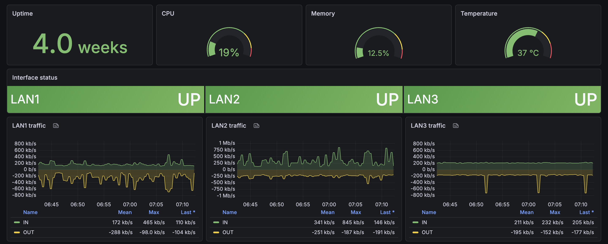

# Yamaha RTX1220 Grafana Dashboard



## Overview

This repository contains a Grafana dashboard definition for monitoring Yamaha RTX1220 devices via SNMP. It assumes you are using Prometheus and the SNMP Exporter as your data sources.

## Requirement

- SNMP must be enabled on the Yamaha RTX1220:
  ```shell
  snmpv2c host any
  snmpv2c community read-only public
  ```
- A working Prometheus + SNMP Exporter setup.
- Grafana 11.0+ (with a "Prometheus" data source configured).

## Usage

1. **Prepare SNMP Exporter config**  
   Create a custom `snmp.yml` with a `yamaha_rtx` module. The module should walk the following OIDs:

   | OID                       | Metric              |
   | ------------------------- | ------------------- |
   | `1.3.6.1.2.1.1.3`         | sysUpTime           |
   | `1.3.6.1.2.1.2.2.1.2`     | ifDescr             |
   | `1.3.6.1.2.1.2.2.1.5`     | ifSpeed             |
   | `1.3.6.1.2.1.2.2.1.7`     | ifAdminStatus       |
   | `1.3.6.1.2.1.2.2.1.8`     | ifOperStatus        |
   | `1.3.6.1.2.1.2.2.1.10`    | ifInOctets          |
   | `1.3.6.1.2.1.2.2.1.13`    | ifInDiscards        |
   | `1.3.6.1.2.1.2.2.1.14`    | ifInErrors          |
   | `1.3.6.1.2.1.2.2.1.16`    | ifOutOctets         |
   | `1.3.6.1.2.1.2.2.1.19`    | ifOutDiscards       |
   | `1.3.6.1.2.1.2.2.1.20`    | ifOutErrors         |
   | `1.3.6.1.4.1.1182.2.1.2`  | yrhMemorySize       |
   | `1.3.6.1.4.1.1182.2.1.3`  | yrhMemoryUsed       |
   | `1.3.6.1.4.1.1182.2.1.4`  | yrhCpuUtil1min      |
   | `1.3.6.1.4.1.1182.2.1.15` | yrhInboxTemperature |

   YAMAHA Private MIB files can be downloaded from:

   > https://www.rtpro.yamaha.co.jp/RT/docs/mib/

2. **Update Prometheus config**  
   In your `prometheus.yml`, add:

   ```yaml
   - job_name: "snmp_rtx1220"
     scrape_interval: 30s
     metrics_path: /snmp
     params:
       auth: [public_v2]
       module: [yamaha_rtx]
     static_configs:
       - targets:
           - 192.168.100.1 # ← change to your RTX1220's IP
     relabel_configs:
       - source_labels: [__address__]
         target_label: __param_target
       - source_labels: [__param_target]
         target_label: instance
       - target_label: __address__
         replacement: "localhost:9116" # ← change to your snmp_exporter address
   ```

3. **Start your stack**

   ```bash
   docker compose up -d
   # or however you start Prometheus and Grafana
   ```

4. **Import into Grafana**
   - Go to **Dashboards → Import**
   - Upload `rtx1220-dashboard.json`
   - Select **Prometheus** as the data source
   - Set the `instance` variable to your RTX1220 IP address

## Description

This dashboard visualizes:

- Uptime
- CPU usage (1 min average, gauge + history)
- Memory usage (gauge + history)
- Internal temperature (gauge + history)
- Interface operational status (UP/DOWN for each LAN)
- Per-LAN traffic (IN/OUT in bps, mirrored graph)
- All interfaces traffic comparison
- Interface errors and discards (rate/s)
- Total error / discard counters (cumulative since last reboot)

Traffic is calculated using `rate(ifInOctets[...]) * 8` to convert bytes/s to bits/s. OUT traffic is displayed as negative values for a mirrored graph view.

## Limitations

- **No per-port traffic for built-in switch ports**: RTX1220's internal LAN1 switch (8 ports) exposes traffic counters only at the aggregate LAN interface level via SNMP, not per individual switch port. This is a hardware/firmware limitation.
- **32-bit counters only**: `ifHCInOctets` / `ifHCOutOctets` (64-bit) are not supported by RTX1220. At typical home/office traffic levels the 32-bit counter wrap (~34 seconds at 1 Gbps full utilization) is not an issue.
