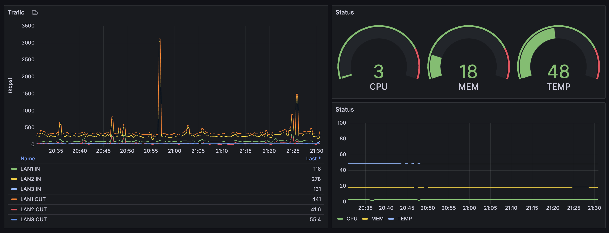

# Yamaha RTX1220 Grafana Dashboard



## Overview

This repository contains a Grafana dashboard definition for monitoring Yamaha RTX1220 devices via SNMP. It assumes you are using Prometheus and the SNMP Exporter as your data sources.

## Requirement

- SNMP must be enabled on the Yamaha RTX1220:
  ```shell
  snmpv2c host any
  snmpv2c community read-only public
  ```
- Download Yamaha’s Private MIB files and place them in a `mibs/` directory:
  > https://www.rtpro.yamaha.co.jp/RT/docs/mib/
- A working Prometheus + SNMP Exporter setup.
- Grafana (with a “Prometheus” data source configured).

## Usage

1. **Prepare SNMP Exporter config**  
   In your `generator.yml`, add:
   ```yaml
   modules:
     # ── Yamaha RTX 1220 ──
     yamaha-rtx1220:
       walk:
         - yrhCpuUtil5sec
         - yrhCpuUtil1min
         - yrhCpuUtil5min
         - yrhMultiCpuTable
         - yrhMultiCpuName
         - yrfRevision
         - yrhInboxTemperature
         - yrfUpTime
         - yrhMemoryUtil
         - yrhMemorySize
         - ifInOctets
         - ifOutOctets
   ```
   Then regenerate `snmp.yml` with the SNMP Exporter generator.

2. **Update Prometheus config**  
   In your `prometheus.yml`, add:
   ```yaml
   # ── YAMAHA RTX 1220 ──
   - job_name: 'snmp_rtx1220'
     static_configs:
       - targets:
           - 192.168.100.1  # ← change to your RTX1220’s IP
         labels:
           name: RTX1220
           vendor: yamaha
     params:
       module:
         - yamaha-rtx1220
     metrics_path: /snmp
     relabel_configs:
       - source_labels: [__address__]
         target_label: __param_target
       - source_labels: [__param_target]
         target_label: instance
       - target_label: __address__
         replacement: "snmp_exporter:9116"
   ```

3. **Start your stack**  
   ```bash
   docker compose up -d
   # or however you start Prometheus and Grafana
   ```

4. **Import into Grafana**  
   - Select **Prometheus** as the data source  
   - Upload `rtx1220-dashboard.json`

## Description

This dashboard visualizes:

- CPU usage
- Memory usage
- Inbox temperature
- Interface traffic (in/out octets)

Make sure your SNMP Exporter is reachable at `snmp_exporter:9116` (or adjust the `replacement` accordingly), and that Prometheus is scraping the RTX1220 with the `yamaha-rtx1220` module. Enjoy real-time monitoring of your Yamaha RTX1220!